Visualizations of My Aldi Performance
================
Ian Curtis

``` r
library(tidyverse)
library(lubridate)
library(ggcorrplot)
library(kableExtra)
```

``` r
# Read Data
aldi <- read_csv(here::here("aldistats.csv"))
aldi$Date <- mdy(aldi$Date)

# Change year to a factor (for graphing)
# Rename variables for tidy data
aldi <- aldi %>% 
    mutate(year = as_factor(year(Date)),
           obs_num = seq.int(nrow(aldi))) %>% 
  rename(date = Date,
         iph = `Items Per Hour`,
         iph_goal = `IPH Goal`,
         percent = Percent,
         avg_items_min = `Avg Items/Min`,
         avg_sec_tender = `Avg Sec/Tender`,
         avg_sec_btwn_cust = `Avg Sec Btwn Cust`,
         n_customers = `# Customers`,
         avg_cart = `Average Cart`,
         one_code = `1-Code %`,
         voids = Voids,
         avg_item_price = `Avg Item Price`,
         over_under = `Over/Under`,
         sales = Sales)
```

## Various Preliminary Explorations

``` r
aldi %>% 
  ggplot(aes(x = percent, group = year, fill = year)) +
  geom_boxplot() +
  scale_fill_brewer(palette = "PuRd") +
  labs(
    title = "Items per Hour Percent Throughout the Years"
  ) +
  xlab("IPH Percent")
```

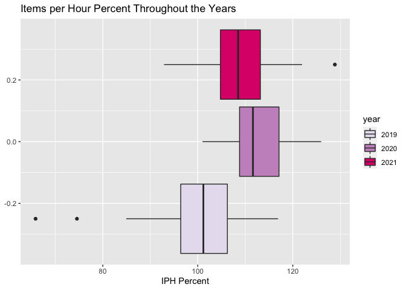<!-- -->

``` r
aldi %>% 
  ggplot(aes(x = year, fill = year)) +
  geom_bar() +
  scale_fill_brewer(palette = "Paired") +
  geom_text(aes(label= ..count.. ), stat = "count", vjust = -0.2) +
  labs(title = "Number of Days Cashiered", subtitle = "By Year")
```

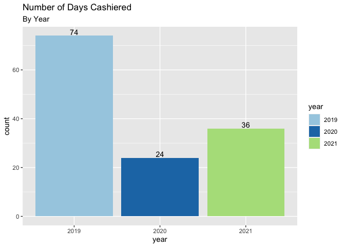<!-- -->

``` r
aldi %>% 
  ggplot(aes(x = obs_num, y = percent)) +
  geom_point() + 
  geom_smooth(color = "orangered4", method = "lm") +
  labs(title = "Items Per Hour Percent Over Time") +
  xlab("") +
  theme(axis.text.x = element_blank(), axis.ticks = element_blank())
```

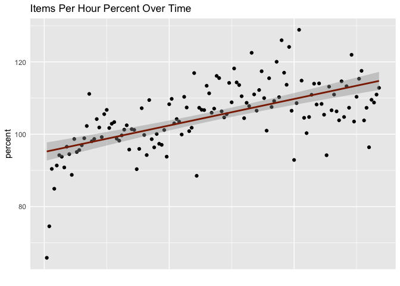<!-- -->

``` r
# Plot with a lot of customizations
# Not really the best output (probably wouldn't publish it)
iph_goal <- aldi %>% 
  ggplot(aes(x = iph, y = iph_goal, color = year)) +
  geom_point() +
  scale_color_brewer(palette = "PuRd") +
  labs(title = "IPH versus IPH Goal", subtitle = "By Year")
iph_goal + theme(
  panel.background = element_rect(fill = "grey30"),
  plot.background = element_rect(fill = "grey20"),
  legend.background = element_rect(fill = "grey60"),
  legend.key = element_rect(fill = "grey20"),
  plot.title = element_text(color = "white"),
  plot.subtitle = element_text(color = "white"),
  axis.text = element_text(color = "grey85"),
  panel.grid.major = element_line(color = "grey85"),
  panel.grid.minor = element_line(color = NA)
)
```

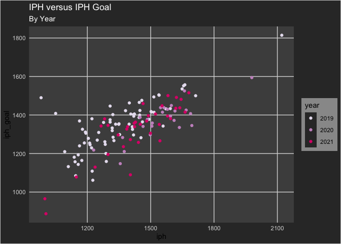<!-- -->

## Exploratory Data Analysis

Let’s look at some of these variables individually.

### Single Variables

``` r
# Function that creates a named vector based off of an inputted summary stat
summaries <- function(func) {aldi %>% 
    select_if(is.numeric) %>% 
    na.exclude() %>% 
    map_dbl(func) %>% 
    map_dbl(round, digits = 3)
}

# Function that creates a histogram and a boxplot of an inputted variable
plots <- function(var, binwidth) {
  histogram <- aldi %>%
    ggplot(aes_string(var)) +
    geom_histogram(color = "white", fill = "black", binwidth = binwidth, na.rm = TRUE)
  boxplot <- aldi %>%
    ggplot(aes_string(var)) +
    geom_boxplot(color = "black", fill = "turquoise4", outlier.color = "red4", na.rm = TRUE)
  list(histogram, boxplot)
  
}

# Create a dataframe with basic summary stats for all variables
summary_stats <- enframe(summaries(mean), name = "statistic", value = "mean") %>% 
  mutate(
         median = unname(summaries(median)),
             sd = unname(summaries(sd)),
             min = unname(summaries(min)),
             max = unname(summaries(max)),
         range = max - min,
         mn_gr_mdn = ifelse(mean > median, TRUE, FALSE)
             )
```

``` r
plots(var = 'one_code', binwidth = 5)
```

    ## [[1]]

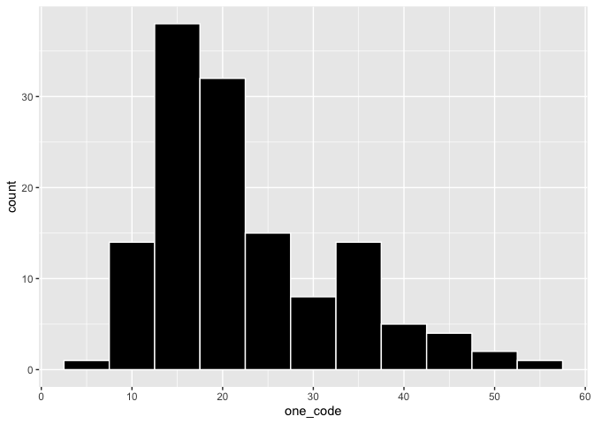<!-- -->

    ## 
    ## [[2]]

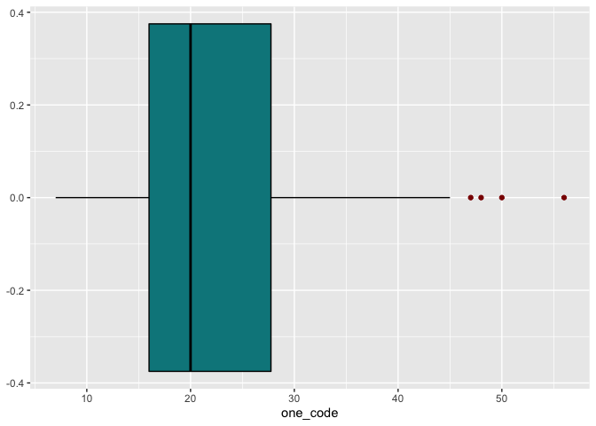<!-- -->

``` r
sum_stat_tbl <- summary_stats %>%
  kbl(col.names = c("Statistic", "Mean", "Median", "Standard Deviation", "Min", "Max", "Range", "Mean > Median?")) %>%
  kable_material("hover", fixed_thead = T) %>% 
  column_spec(8, color = ifelse(summary_stats$mn_gr_mdn == "TRUE", "blue", '#9A18C2')) %>% 
  column_spec(2, color = "blue") %>% 
  column_spec(3, color = "#9A18C2")
sum_stat_tbl
```

<table class=" lightable-material lightable-hover" style="font-family: &quot;Source Sans Pro&quot;, helvetica, sans-serif; margin-left: auto; margin-right: auto;">
<thead>
<tr>
<th style="text-align:left;position: sticky; top:0; background-color: #FFFFFF;">
Statistic
</th>
<th style="text-align:right;position: sticky; top:0; background-color: #FFFFFF;">
Mean
</th>
<th style="text-align:right;position: sticky; top:0; background-color: #FFFFFF;">
Median
</th>
<th style="text-align:right;position: sticky; top:0; background-color: #FFFFFF;">
Standard Deviation
</th>
<th style="text-align:right;position: sticky; top:0; background-color: #FFFFFF;">
Min
</th>
<th style="text-align:right;position: sticky; top:0; background-color: #FFFFFF;">
Max
</th>
<th style="text-align:right;position: sticky; top:0; background-color: #FFFFFF;">
Range
</th>
<th style="text-align:left;position: sticky; top:0; background-color: #FFFFFF;">
Mean \> Median?
</th>
</tr>
</thead>
<tbody>
<tr>
<td style="text-align:left;">
iph
</td>
<td style="text-align:right;color: blue !important;">
1447.000
</td>
<td style="text-align:right;color: #9A18C2 !important;">
1446.500
</td>
<td style="text-align:right;">
173.638
</td>
<td style="text-align:right;">
999.00
</td>
<td style="text-align:right;">
1663.00
</td>
<td style="text-align:right;">
664.00
</td>
<td style="text-align:left;color: blue !important;">
TRUE
</td>
</tr>
<tr>
<td style="text-align:left;">
iph_goal
</td>
<td style="text-align:right;color: blue !important;">
1315.599
</td>
<td style="text-align:right;color: #9A18C2 !important;">
1349.305
</td>
<td style="text-align:right;">
131.532
</td>
<td style="text-align:right;">
965.14
</td>
<td style="text-align:right;">
1491.36
</td>
<td style="text-align:right;">
526.22
</td>
<td style="text-align:left;color: #9A18C2 !important;">
FALSE
</td>
</tr>
<tr>
<td style="text-align:left;">
percent
</td>
<td style="text-align:right;color: blue !important;">
109.893
</td>
<td style="text-align:right;color: #9A18C2 !important;">
109.935
</td>
<td style="text-align:right;">
6.208
</td>
<td style="text-align:right;">
96.40
</td>
<td style="text-align:right;">
121.96
</td>
<td style="text-align:right;">
25.56
</td>
<td style="text-align:left;color: #9A18C2 !important;">
FALSE
</td>
</tr>
<tr>
<td style="text-align:left;">
avg_items_min
</td>
<td style="text-align:right;color: blue !important;">
45.500
</td>
<td style="text-align:right;color: #9A18C2 !important;">
46.500
</td>
<td style="text-align:right;">
3.406
</td>
<td style="text-align:right;">
38.00
</td>
<td style="text-align:right;">
50.00
</td>
<td style="text-align:right;">
12.00
</td>
<td style="text-align:left;color: #9A18C2 !important;">
FALSE
</td>
</tr>
<tr>
<td style="text-align:left;">
avg_sec_tender
</td>
<td style="text-align:right;color: blue !important;">
19.688
</td>
<td style="text-align:right;color: #9A18C2 !important;">
19.000
</td>
<td style="text-align:right;">
2.272
</td>
<td style="text-align:right;">
16.00
</td>
<td style="text-align:right;">
24.00
</td>
<td style="text-align:right;">
8.00
</td>
<td style="text-align:left;color: blue !important;">
TRUE
</td>
</tr>
<tr>
<td style="text-align:left;">
avg_sec_btwn_cust
</td>
<td style="text-align:right;color: blue !important;">
0.812
</td>
<td style="text-align:right;color: #9A18C2 !important;">
1.000
</td>
<td style="text-align:right;">
0.403
</td>
<td style="text-align:right;">
0.00
</td>
<td style="text-align:right;">
1.00
</td>
<td style="text-align:right;">
1.00
</td>
<td style="text-align:left;color: #9A18C2 !important;">
FALSE
</td>
</tr>
<tr>
<td style="text-align:left;">
n_customers
</td>
<td style="text-align:right;color: blue !important;">
76.750
</td>
<td style="text-align:right;color: #9A18C2 !important;">
62.000
</td>
<td style="text-align:right;">
58.522
</td>
<td style="text-align:right;">
16.00
</td>
<td style="text-align:right;">
248.00
</td>
<td style="text-align:right;">
232.00
</td>
<td style="text-align:left;color: blue !important;">
TRUE
</td>
</tr>
<tr>
<td style="text-align:left;">
avg_cart
</td>
<td style="text-align:right;color: blue !important;">
47.125
</td>
<td style="text-align:right;color: #9A18C2 !important;">
47.360
</td>
<td style="text-align:right;">
7.004
</td>
<td style="text-align:right;">
33.88
</td>
<td style="text-align:right;">
58.13
</td>
<td style="text-align:right;">
24.25
</td>
<td style="text-align:left;color: #9A18C2 !important;">
FALSE
</td>
</tr>
<tr>
<td style="text-align:left;">
one_code
</td>
<td style="text-align:right;color: blue !important;">
29.500
</td>
<td style="text-align:right;color: #9A18C2 !important;">
30.500
</td>
<td style="text-align:right;">
6.623
</td>
<td style="text-align:right;">
17.00
</td>
<td style="text-align:right;">
38.00
</td>
<td style="text-align:right;">
21.00
</td>
<td style="text-align:left;color: #9A18C2 !important;">
FALSE
</td>
</tr>
<tr>
<td style="text-align:left;">
voids
</td>
<td style="text-align:right;color: blue !important;">
0.367
</td>
<td style="text-align:right;color: #9A18C2 !important;">
0.245
</td>
<td style="text-align:right;">
0.395
</td>
<td style="text-align:right;">
0.00
</td>
<td style="text-align:right;">
1.54
</td>
<td style="text-align:right;">
1.54
</td>
<td style="text-align:left;color: blue !important;">
TRUE
</td>
</tr>
<tr>
<td style="text-align:left;">
avg_item_price
</td>
<td style="text-align:right;color: blue !important;">
2.345
</td>
<td style="text-align:right;color: #9A18C2 !important;">
2.280
</td>
<td style="text-align:right;">
0.188
</td>
<td style="text-align:right;">
2.14
</td>
<td style="text-align:right;">
2.90
</td>
<td style="text-align:right;">
0.76
</td>
<td style="text-align:left;color: blue !important;">
TRUE
</td>
</tr>
<tr>
<td style="text-align:left;">
over_under
</td>
<td style="text-align:right;color: blue !important;">
-0.557
</td>
<td style="text-align:right;color: #9A18C2 !important;">
-0.185
</td>
<td style="text-align:right;">
1.411
</td>
<td style="text-align:right;">
-5.74
</td>
<td style="text-align:right;">
0.27
</td>
<td style="text-align:right;">
6.01
</td>
<td style="text-align:left;color: #9A18C2 !important;">
FALSE
</td>
</tr>
<tr>
<td style="text-align:left;">
sales
</td>
<td style="text-align:right;color: blue !important;">
3702.838
</td>
<td style="text-align:right;color: #9A18C2 !important;">
3053.120
</td>
<td style="text-align:right;">
2814.551
</td>
<td style="text-align:right;">
584.87
</td>
<td style="text-align:right;">
11840.41
</td>
<td style="text-align:right;">
11255.54
</td>
<td style="text-align:left;color: blue !important;">
TRUE
</td>
</tr>
<tr>
<td style="text-align:left;">
obs_num
</td>
<td style="text-align:right;color: blue !important;">
126.500
</td>
<td style="text-align:right;color: #9A18C2 !important;">
126.500
</td>
<td style="text-align:right;">
4.761
</td>
<td style="text-align:right;">
119.00
</td>
<td style="text-align:right;">
134.00
</td>
<td style="text-align:right;">
15.00
</td>
<td style="text-align:left;color: #9A18C2 !important;">
FALSE
</td>
</tr>
</tbody>
</table>

``` r
#save_kable(sum_stat_tbl, `summary_stats.png`)
```

### Multiple Variables

``` r
# Select only numeric variables from original dataset
aldi_num <- aldi %>% 
  select_if(is.numeric)
aldi_num <- aldi_num[-c(11, 12, 13, 14)]

# Matrix of Correlation Values
corr <- round(cor(aldi_num), 2)

# Visualization of Correlation Matrix
ggcorrplot(
  corr,
  hc.order = TRUE,
  type = "lower",
  lab = TRUE,
  outline.color = "white",
  ggtheme = ggplot2::theme_dark,
  colors = c("#6D9EC1", "white", "#E46726")
)
```

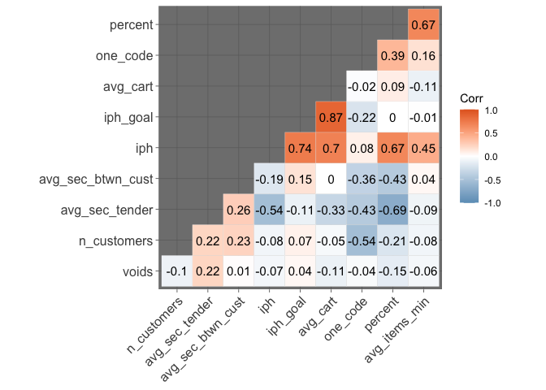<!-- -->

Interestingly enough, there are not a lot of strong correlations here.
The 0.7 value between Percent and Avg Items/Min and Items Per Hour is
not surprising since the Percent is calculated using Items Per Hour. We
do see a decently strong negative correlation Percent and Avg
Sec/Tender. The most surprising to me are the ones with Average Cart.
The IPH Goal should not be so correlated with Average Cart since
cashiers cannot control how much money a customer will spend. There is
some sense to the correlation between Average Cart and Items Per Hour:
typically customers spending more money will have more items in their
cart which allows the cashier to move faster.

``` r
aldi %>% 
  ggplot(aes(x = iph, y = iph_goal, color = year)) +
  geom_point() +
  geom_smooth(color = "black", method = "lm")
```

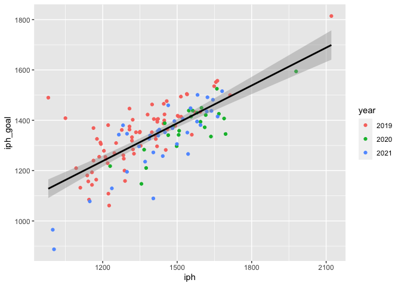<!-- -->

Not surprisingly, as IPH increases, so does the IPH Goal, with few
observations outside of the positve, linear pattern.

``` r
aldi %>% 
  ggplot(aes(x = avg_items_min, y = iph_goal, color = year)) +
  geom_point() +
  geom_smooth(color = "black", method = "lm")
```

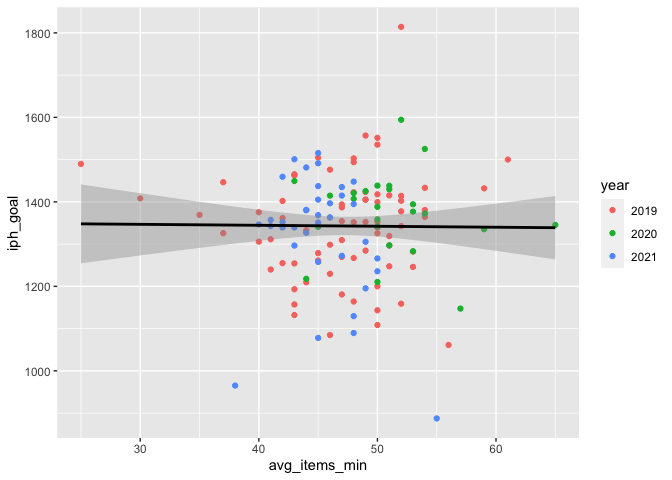<!-- -->

Somehow, it does not appear that Average Items Per Minute has a
substantive effect on the IPH Goal. There is much less of a linear
pattern; rather, it has a circular, cloud shape. I would have liked to
see more of a relationship here. The faster you go over time, the higher
your goal should be.

``` r
aldi %>% 
  ggplot(aes(x = avg_sec_tender, y = iph_goal, color = year)) +
  geom_point() +
  geom_smooth(color = "black", method = "lm")
```

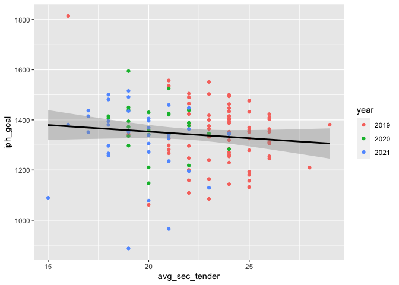<!-- -->

It looks like there is a slightly negative correlation between these two
variables. However, it is to be determined if there this relationship is
signficiant (at first glance, it does not appear so).

``` r
aldi %>% 
  ggplot(aes(x = avg_sec_btwn_cust, y = iph_goal, color = year)) +
  geom_point() +
  geom_smooth(color = "black", method = "lm")
```

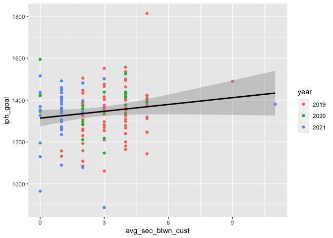<!-- -->

There appears to be no relationship here. Outliers are pulling the line
of best fit to a positive direction when the two variables don’t appear
to be related to each other.

``` r
aldi %>% 
  ggplot(aes(x = n_customers, y = iph_goal, color = year)) +
  geom_point() +
  geom_smooth(color = "black", method = "lm")
```

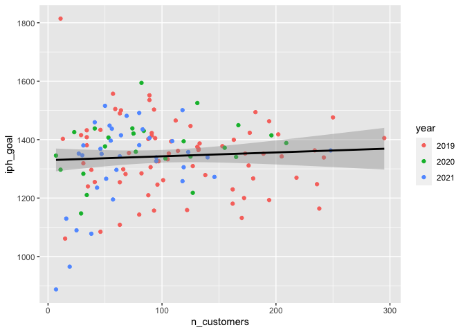<!-- -->

Number of Customers looks to have zero effect on the creation of the IPH
Goal. This makes sense as the number of customers a cashier has cannot
be controlled by the cashier themselves. (However, this can be
“controlled” as managers choose to keep certain cashiers ringing for
longer.)

``` r
aldi %>% 
  ggplot(aes(x = avg_cart, y = iph_goal, color = year)) +
  geom_point() +
  geom_smooth(color = "black", method = "lm")
```

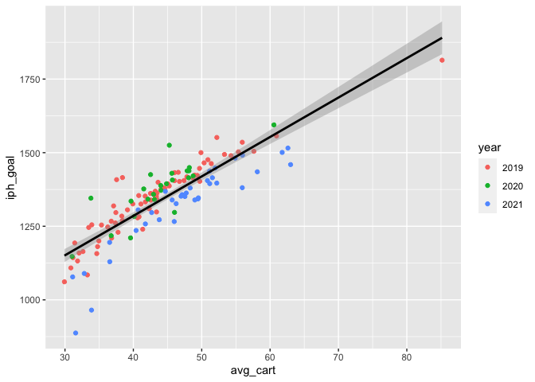<!-- -->

This is a very surprising result. Average Cart, the variable that
measures the average transaction total each day is strongly correlated
with the IPH Goal. This doesn’t seem right…cashiers cannot control how
much a customer spends nor which customer comes to their checklane.

``` r
aldi %>% 
  ggplot(aes(x = one_code, y = iph_goal, color = year)) +
  geom_point() +
  geom_smooth(color = "black", method = "lm")
```

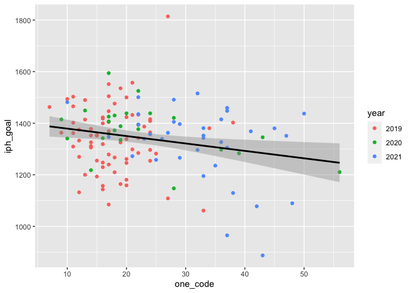<!-- -->

I am not sure what trend I expect to see here. 1-Code % is not
necessarily associated with cashier speed but is can be a factor
associated with it. Many cashiers use the 1-Code to stop the timers on
some of the statistics here. I believe that a higher 1-Code should mean
a higher goal.

``` r
aldi %>% 
  #filter(Voids < 6) %>% 
  ggplot(aes(x = voids, y = iph_goal, color = year)) +
  geom_point() +
  geom_smooth(color = "black", method = "lm")
```

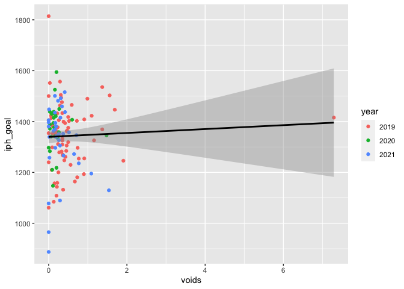<!-- -->

Both with and without the outlier, there is very little relationship
between voids and IPH Goal. This does make sense as voids have little
influence on speed. I should have recorded *number of voids* rather than
voids as percentage of sales. We want cashiers to have as little voids
as possible to help them not be suspected of theft and to help them not
have to stop and void an item.

``` r
aldi %>% 
  ggplot(aes(x = avg_item_price, y = iph_goal, color = year)) +
  geom_point() +
  geom_smooth(color = "black", method = "lm")
```

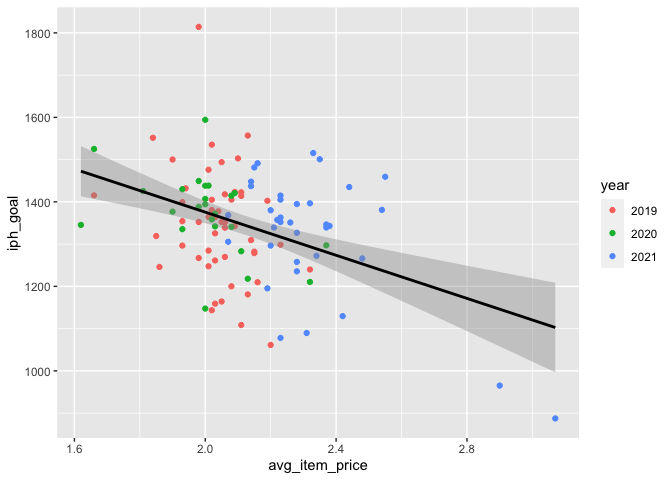<!-- -->

I am surprised to see a relationship here, even though it is negative.
Cashiers have no control over the price of items. However, I don’t think
that Item Price has that big of an effect on the IPH Goal. There are two
outliers - (2.83, 950) and (3.1, 890) - that may be dragging the right
end of the line down and one outlier - (1.9, 1810) - that may be
bringing the left end up.

``` r
aldi %>% 
  filter(iph_goal < 1700 & iph_goal > 1000) %>% 
  ggplot(aes(x = avg_item_price, y = iph_goal, color = year)) +
  geom_point() +
  geom_smooth(color = "black", method = "lm")
```

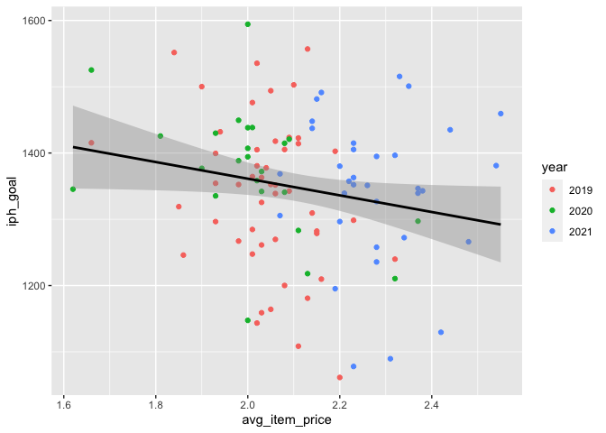<!-- -->

Removing those possible outliers, we still see a negative relationship.
I don’t think removing the outliers right now is justified.

## Predicting IPH Goal

Let’s see if we can predict the IPH Goal for me. It is currently unknown
how the goal is generated and the goal only appears after each day’s
cashiering. Can we predict the IPH goal for the next day based on
existed data? Later on, we will try to create a new way of generating a
goal.

``` r
model_nointer <- lm(iph_goal ~ iph + avg_items_min + avg_sec_tender + avg_sec_btwn_cust + n_customers + avg_cart + one_code + voids, data = aldi)

summary(model_nointer)
```

    ## 
    ## Call:
    ## lm(formula = iph_goal ~ iph + avg_items_min + avg_sec_tender + 
    ##     avg_sec_btwn_cust + n_customers + avg_cart + one_code + voids, 
    ##     data = aldi)
    ## 
    ## Residuals:
    ##     Min      1Q  Median      3Q     Max 
    ## -75.421 -13.887  -0.503  13.122 105.909 
    ## 
    ## Coefficients:
    ##                    Estimate Std. Error t value Pr(>|t|)    
    ## (Intercept)       140.45628   43.72408   3.212  0.00167 ** 
    ## iph                 0.71971    0.03572  20.149  < 2e-16 ***
    ## avg_items_min     -10.31617    0.79344 -13.002  < 2e-16 ***
    ## avg_sec_tender     20.36088    1.28308  15.869  < 2e-16 ***
    ## avg_sec_btwn_cust  20.00305    1.60560  12.458  < 2e-16 ***
    ## n_customers         0.01378    0.04280   0.322  0.74804    
    ## avg_cart            3.53745    0.61125   5.787 5.43e-08 ***
    ## one_code            0.68760    0.33286   2.066  0.04092 *  
    ## voids               4.70625    3.38261   1.391  0.16660    
    ## ---
    ## Signif. codes:  0 '***' 0.001 '**' 0.01 '*' 0.05 '.' 0.1 ' ' 1
    ## 
    ## Residual standard error: 25.69 on 125 degrees of freedom
    ## Multiple R-squared:  0.9617, Adjusted R-squared:  0.9593 
    ## F-statistic: 392.5 on 8 and 125 DF,  p-value: < 2.2e-16

Although we haven’t checked our assumptions, let’s fit the model again
without the non-significant variables from this first model.

``` r
model2_nointer <- lm(iph_goal ~ iph + avg_items_min + avg_sec_tender + avg_sec_btwn_cust + avg_cart, data = aldi)

summary(model2_nointer)
```

    ## 
    ## Call:
    ## lm(formula = iph_goal ~ iph + avg_items_min + avg_sec_tender + 
    ##     avg_sec_btwn_cust + avg_cart, data = aldi)
    ## 
    ## Residuals:
    ##     Min      1Q  Median      3Q     Max 
    ## -75.408 -14.052  -1.477  13.340 110.094 
    ## 
    ## Coefficients:
    ##                   Estimate Std. Error t value Pr(>|t|)    
    ## (Intercept)       183.3664    37.7813   4.853 3.47e-06 ***
    ## iph                 0.6972     0.0316  22.062  < 2e-16 ***
    ## avg_items_min      -9.8010     0.7066 -13.870  < 2e-16 ***
    ## avg_sec_tender     19.3282     1.0462  18.474  < 2e-16 ***
    ## avg_sec_btwn_cust  18.6213     1.4637  12.722  < 2e-16 ***
    ## avg_cart            3.7564     0.5720   6.567 1.16e-09 ***
    ## ---
    ## Signif. codes:  0 '***' 0.001 '**' 0.01 '*' 0.05 '.' 0.1 ' ' 1
    ## 
    ## Residual standard error: 26.15 on 128 degrees of freedom
    ## Multiple R-squared:  0.9594, Adjusted R-squared:  0.9578 
    ## F-statistic: 604.6 on 5 and 128 DF,  p-value: < 2.2e-16

The regression equation (assuming linearity is applicable) for predicted
IPH Goal is
Predicted IPH Goal = 182.698 + 0.696 × IPH − 9.782 × Avg Items/Min + 19.297 × Avg Sec/Tender + 18.559 × Avg Sec Btwn Cust + 3.8112 × Average Cart Total.

# Simulations of Data (Not related to Aldi)

``` r
# Simulate 1000 random numbers from many distributions learned in STA 412
set.seed(572341046)
rand_nums <- tibble(
  expo = rexp(1000, rate = 4),
  poisson = rpois(1000, lambda = 7),
  normal = rnorm(1000, mean = 4, sd = .1113),
  beta = rbeta(1000, 3, 4),
  gamma = rgamma(1000, shape = 3, scale = 4),
  geom = rgeom(1000, .4),
  binom = rbinom(1000, 3, .4),
  uniform = runif(1000, min = 7, max = 13),
  hypergeom = rhyper(nn = 1000, m = 7, n = 13, k = 5),
  chisq = rchisq(1000, 13)
)

# Calculate various statistics for each of the simulated distributions
rand_stats <- rand_nums %>% 
  pivot_longer(cols = everything(), names_to = "distribution", values_to = "values") %>% 
  group_by(distribution) %>% 
  mutate(across(.cols = everything(), list(mean = mean, median = median, sd = sd, min = min, max = max))) %>% 
  select(distribution, contains("_")) %>% 
  ungroup() %>% 
  slice_head(n = 10)
```

``` r
# Create 1000 bootstrap samples for each distribution,  calculate the mean of each sample and then the mean of the means
boots <- rand_nums %>% 
  map(~ replicate(100, sample(.x, 1000, replace = TRUE)) %>% 
  map(mean)) %>% 
  map(unlist) %>% 
  map(mean) %>% 
  unlist()

# Append bootstrap means to statistics df above
# Shows effect of law of large numbers
rand_stats %>% 
  rename(
    mean = values_mean,
    median = values_median,
    sd = values_sd,
    min = values_min,
    max = values_max
  ) %>% 
  mutate(boot_mean = unname(boots),
         expected_value = c(4, 7, 4, 3/7, 12, 2.5, 1.2, 10, 1.75, 13))
```

    ## # A tibble: 10 × 8
    ##    distribution   mean median    sd      min    max boot_mean expected_value
    ##    <chr>         <dbl>  <dbl> <dbl>    <dbl>  <dbl>     <dbl>          <dbl>
    ##  1 expo          0.264  0.178 0.268 0.000111  2.11      0.263          4    
    ##  2 poisson       6.99   7     2.63  0        17         7.00           7    
    ##  3 normal        3.99   4.00  0.110 3.64      4.35      3.99           4    
    ##  4 beta          0.425  0.421 0.177 0.00635   0.891     0.425          0.429
    ##  5 gamma        11.9   10.4   6.97  0.471    49.8      11.9           12    
    ##  6 geom          1.43   1     1.86  0        12         1.43           2.5  
    ##  7 binom         1.22   1     0.864 0         3         1.21           1.2  
    ##  8 uniform      10.0   10.0   1.71  7.01     13.0      10.0           10    
    ##  9 hypergeom     1.70   2     0.959 0         5         1.70           1.75 
    ## 10 chisq        13.0   12.4   5.00  2.73     39.6      13.0           13
